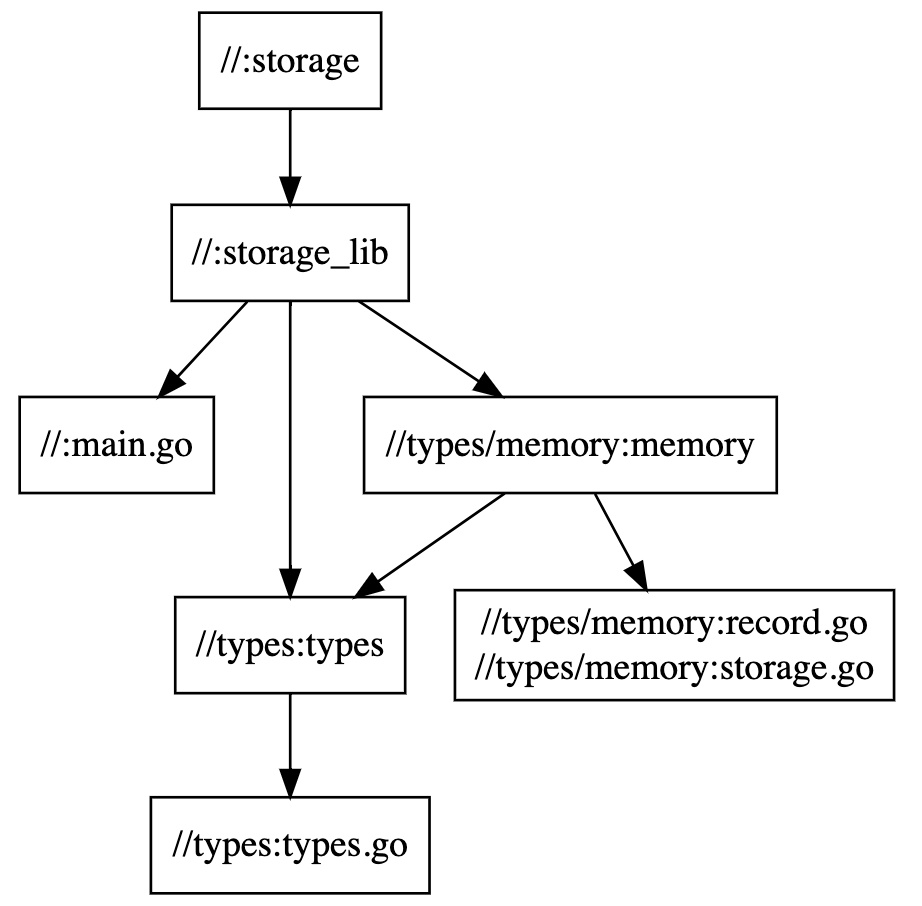

# Sample storage interface

Playing with go interfaces, bazel and gazelle.

Install bazel and Run these to get going:
```bash
bazel run //:gazelle
bazel run //:storage
```

Visualize dependencies with:
```bash
bazel query --notool_deps --noimplicit_deps "deps(//:storage)" --output graph
```

